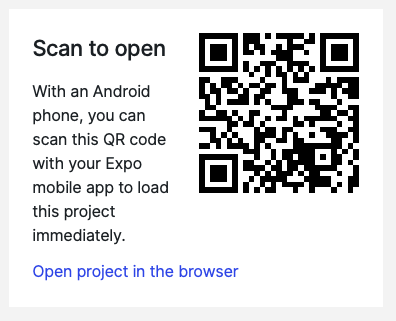

# Career Compass App

### [NVM](https://github.com/nvm-sh/nvm#installing-and-updating)

```shell
#if not installed

#bash shell
curl -o- https://raw.githubusercontent.com/nvm-sh/nvm/v0.37.2/install.sh | bash

#zsh shell
curl -o- https://raw.githubusercontent.com/nvm-sh/nvm/v0.37.2/install.sh | zsh

```

node version in use v14.15.5

```shell
$ nvm install 14.15.5  #if not installed

$ nvm use  14.15.5 #manually switch to node version
```

Setup nvm [Deeper Shell Integration for NVM](https://github.com/nvm-sh/nvm#deeper-shell-integration) - Automatically call `nvm use`

### Docker

Download the docker if not installed from following [link](https://www.docker.com/products/docker-desktop)

### QR CODE (Expo published)

Install Expo GO Client app to test the app [Android](https://play.google.com/store/apps/details?id=host.exp.exponent&hl=en_IN&gl=US) [iOS](https://apps.apple.com/us/app/expo-go/id982107779)

Scan the QR code and run the app.


### Server

```shell
$ cd server/ #check the README.md files
```

### Client

```shell
$ cd client/ #check the README.md files
```
